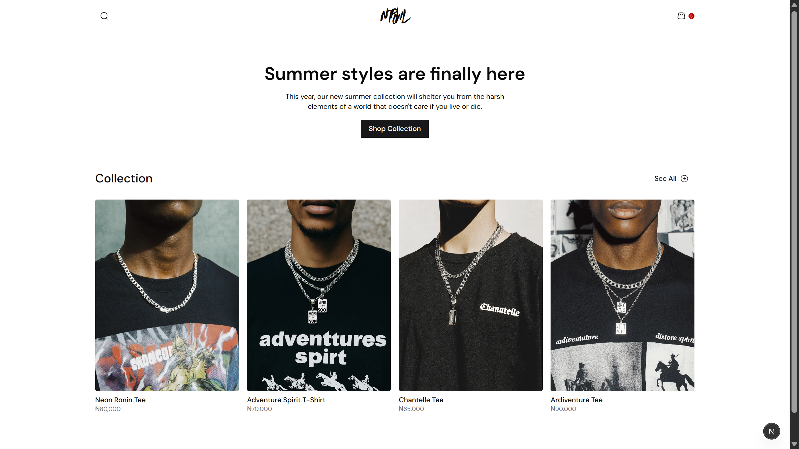
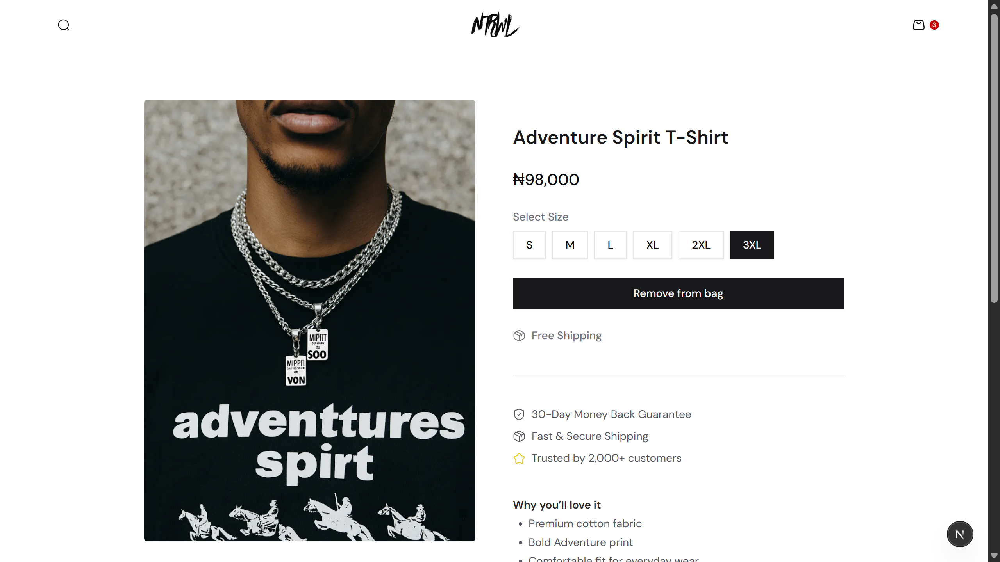
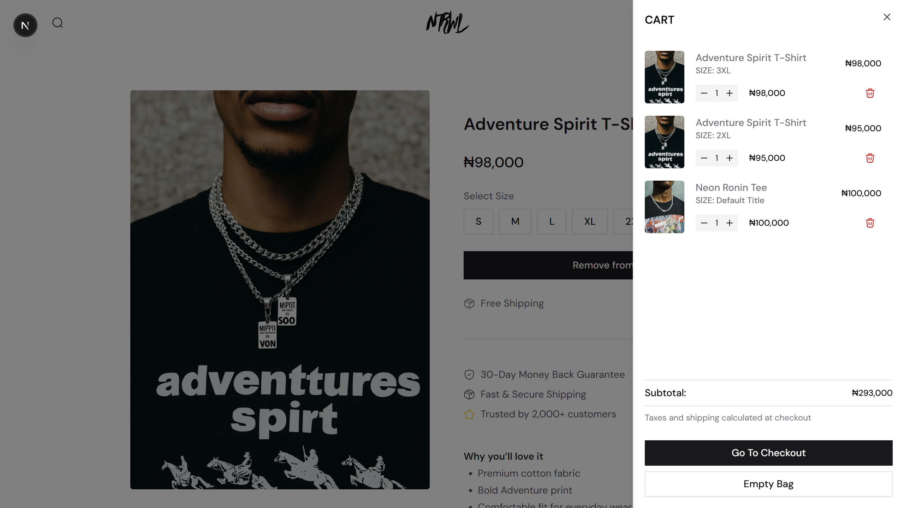

# 🛍️ Simple E-commerce Store with Shopify + Next.js

This project is a minimalist, performant e-commerce storefront built using **Next.js App Router** and powered by **Shopify Storefront API**. It’s designed to be clean, fast, and easy to extend — perfect for small brands or case studies.

---

## 📸 Instagram Post

**Title:**  
> _“How I Built a Simple E-commerce Store with Next.js and Shopify”_

Check it out on Instagram: [@raheem.code](https://instagram.com/@raheem.code)

---

## ⚙️ Tech Stack

- **Next.js 15** – App Router, Server Components, SSR/ISR
- **TypeScript** – Fully typed for safety
- **Shopify Storefront API** – Product and variant data
- **Tailwind CSS** – Clean UI and responsive design
- **Zustand** – Lightweight global state (cart)
- **NUQS** – Query string state for selected variants
- **Sonner** – For toast notifications
- **html-react-parser** – Custom rendering for rich product descriptions

---

## ✨ Features

- 🔍 View all products from Shopify
- 🛒 Add to cart with variant selection
- 📦 Cart sheet with quantity management and persistent state
- 🧩 Variant-aware pricing and availability
- 📄 Beautiful product pages with custom HTML rendering
- 🚚 Free shipping & 30-day return messaging
- ⚡ ISR (Incremental Static Regeneration) with on-demand revalidation ready
- 💬 Instagram-style mobile-friendly layout

---

## 🖼️ Screenshots

| Home | Product | Cart |
|------|---------|------|
|  |  |  |

> (Add your screenshots to `public/screenshots/`)

---

## 🧪 Running Locally

```bash
git clone https://github.com/R4heem-Orekoya/NTRWL
cd NTRWL
pnpm install
```

.env.local
```bash
SHOPIFY_DOMAIN=your-shop.myshopify.com
SHOPIFY_STOREFRONT_ACCESS_TOKEN=your-token
```

```bash
pnpm dev